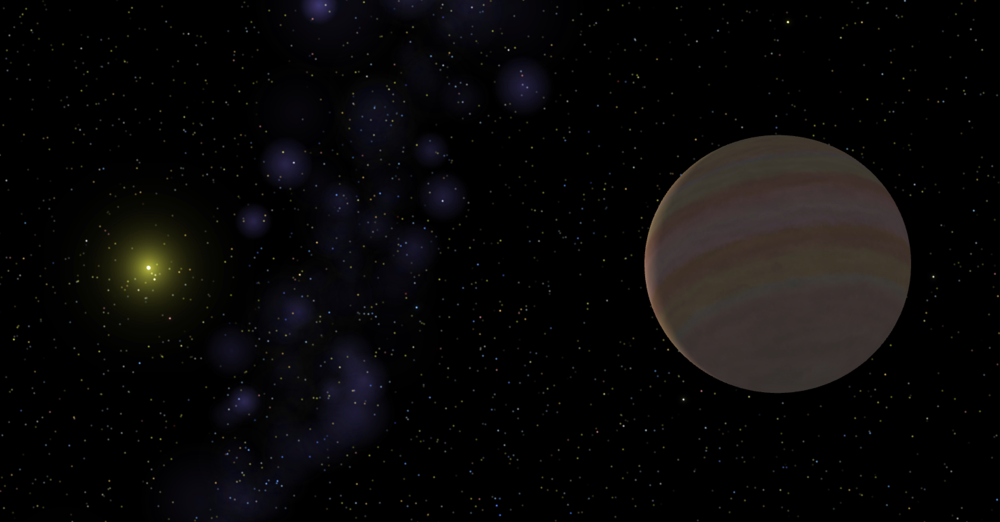
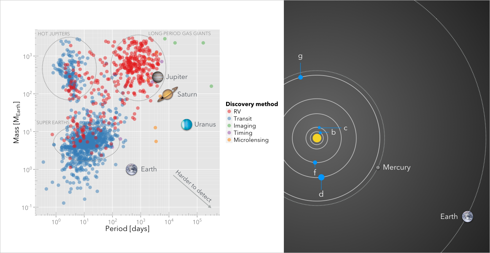

An article I am writing for [The Conversation](https://theconversation.com/us) about [this paper](http://arxiv.org/abs/1512.00417) (Rowan et al. 2015, *The Lick-Carnegie Exoplanet Survey: HD32963 -- A New Jupiter Analog Orbiting a Sun-like Star*).

:construction_worker: It's a work in progress, and it will suck for a while. :construction_worker:

# Key points
- The paper asks if Jupiter analogs (planets similar to Jupiter) orbiting Sun-like stars are rare. This is crucial to understanding whether the Solar System is "typical", since much of the Solar System's formation history and architecture was determined by Jupiter. 
- Mr. Rowan's paper determines that only about 3% of all stars host a Jupiter analog, which has important implications for our search for "Earth twins" and life outside the Solar System. 
- It also reports on the discovery of a new Jupiter analog orbiting a star very similar to the Sun, HD 32963 b. Mr. Rowan discovered this planet by analyzing over 16 years of observations taken with the Keck telescope in Hawaii. 
- Finally, this paper shows the importance of training our students in scientific research using real astronomical data, and tools that are accessible enough to be used without formal training (ref. my previous article: https://theconversation.com/telescope-apps-help-amateurs-hunt-for-exoplanets-24925).

## TODO ##
* Desperately seeking Better Title
* Desperately seeking Better Closure

*Artistic representation of the Jupiter-like planet orbiting the star HD 32963.*

# Is the Solar System typical? High school student adds another piece to the puzzle #

Is our little corner of the Galaxy a special place? As of today, we have [discovered more than 1,500 exoplanets](http://exoplanets.org) (planets orbiting stars other than the Sun), with thousands more candidates waiting for confirmation in the pipeline. The figure below (called a *mass-period diagram*) shows the periods and masses of the planets discovered so far, compared with the properties of Solar System planets. A cursory look at the figure shows that planets like the Earth, Jupiter, Saturn and Uranus occupy "empty" parts of the diagram, seemingly indicating that the majority of planetary systems do not resemble our own Solar System. We lack close-in planets (planets with periods between 1 and 100 days) and any super-Earths (a common class of planets with masses a few times the mass of the Earth), but we have several long-period gas giants with orbits very close to circular.

*Left: a mass-period diagram. Each dot is a confirmed exoplanet. Right: the planetary system HD 219134 compared to the inner Solar System. In this system, at least 5 planets orbit so close to the central star that their "years" are only between 3 and 94 days long.*

Part of this discrepancy is due to *selection effects*: close-in, massive planets are easier to discover than far-out, low-mass planets. In light of this, [a recent paper by Drs. Rebecca Martin and Mario Livio](http://aasnova.org/2015/09/25/how-normal-is-our-solar-system/) argues that the Solar System is overall more typical than previously thought based on a number of features. There is a sticking point, however: Jupiter still stands out as an outlier, based both on its orbital location (with a period of about 12 years) and its very-close-to-circular orbit.

## Throwing its weight around ##
According to our understanding of how the Solar System formed, Jupiter shaped much of its early history. It influenced the formation of Saturn, cleared the inner Solar System out of debris, and potentially facilitated the development of life by shielding Earth from collisions. As a consequence, understanding whether Jupiter is a relatively common planet might be crucial to understanding whether *true* Solar Systems are abundant in the Galaxy, and -- by extension -- planets like Earth.

Despite their relative heft, discovering *Jupiter analogs* (planets with periods and masses similar to those of Jupiter's) is challenging, since their long orbital periods require monitoring a star for a long time. Jupiter-like planets are typically discovered using an indirect detection technique called the radial velocity method. The gravitational pull of a planet on the central star will cause the wavelength of the light we receive to shift towards bluer or redder colors in a distinctive, period pattern. This periodic signal can require the monitoring of a star over many years, or even decades.

## Are Jupiter-like planets rare? ##
[In a recent paper](http://arxiv.org/abs/1512.00417), Dominick Rowan, a high-school senior, and his co-authors (astronomers from the University of Texas, the University of California at Santa Cruz, and more) analyzed data taken at the Keck telescope in Hawaii for more than 1,100 stars. Many of those stars had been monitored for 10 years or more. To carry out the study, he used an application freely available to the community called [Systemic](https://theconversation.com/telescope-apps-help-amateurs-hunt-for-exoplanets-24925), which is also widely used in [University classrooms](http://www.save-point.io) to teach how astronomical data is analyzed.

The team re-analyzed the available data and calculated the probability that a Jupiter-like planet could have been missed (either because not enough data is available, or because the data is not high-quality enough). They accomplished this by simulating several hundreds of thousands of possible scenarios. This procedure makes it possible to infer how many Jupiter analogs (both discovered and undiscovered) orbited the 1,100 sample of stars. While carrying out this analysis, they discovered a [new Jupiter-like planet](http://exoplanet.eu/catalog/hd_32963_b/) orbiting HD 32963, which is a star very similar to the Sun in terms of age and physical properties.

The procedure pinpointed the frequency of Jupiter analogs across the survey at approximately 3%. This result is broadly consistent with previous estimates, but is greatly strengthened by the availability of *decades* of observations that were taken into account in the simulations. 

This result has several consequences. First, the relative rarity of Jupiter-like planets indicates that true Solar System analogs should be themselves rare. By extension, given the important role that Jupiter played at all stages of the formation of the Solar System, Earth-like habitable planets might be rarer than previously thought. In our Solar System, the presence of Jupiter might have disturbed the formation of super-Earth planets with massive atmospheres, thereby ensuring that the inner Solar System is populated with small, rocky planets with thin atmospheres. It might have also indirectly funneled water towards Earth by stirring and slinging icy bodies from the asteroid belt.

Finally, it also means that Jupiter-like planets do not form as easily around stars, either because not enough solid material is available, or because they migrate closer to the central stars very efficiently. This explanation is tentatively borne out by our planet formation simulations.

Perhaps our Solar System is really a unique place after all!
